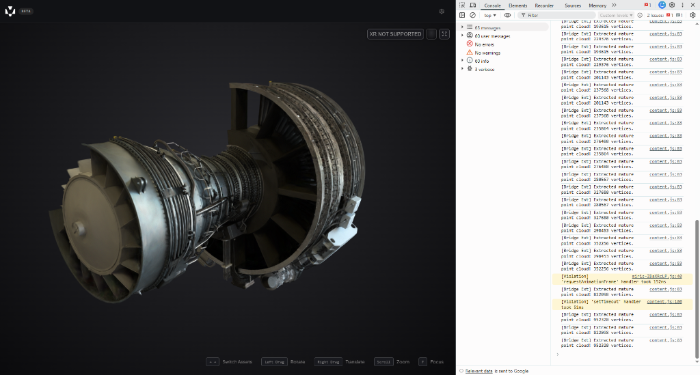
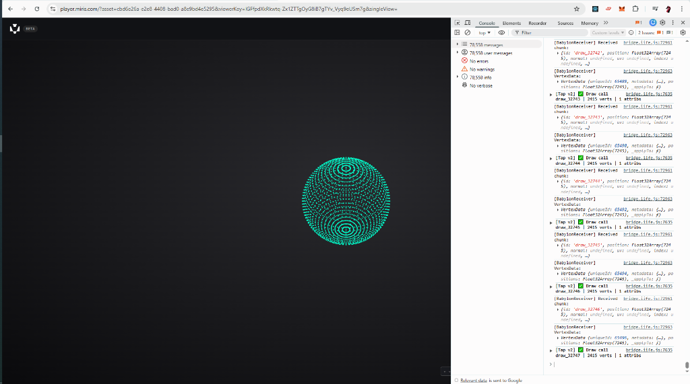
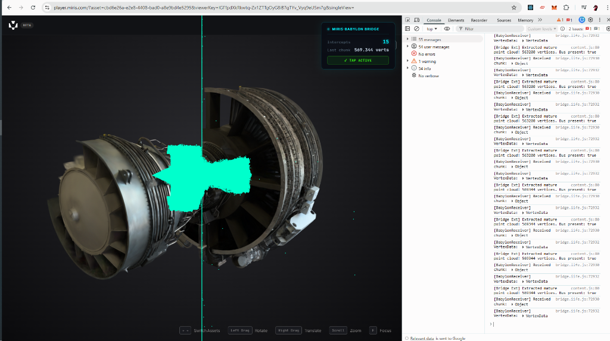

# Miris Render Engine: Reverse Engineering Post-Mortem

This document chronicles our end-to-end journey of intercepting and reverse-engineering the proprietary Miris OpenUSD rendering engine on the web. What started as a straightforward mission to bridge WebGL geometry into BabylonJS evolved into a complete deconstruction of a highly sophisticated GPU compute-splatting architecture.

## Visual Milestones

![Phase 4 Eureka: The Giant Black Full-Screen Triangle [(-1,-1), (3,-1), (-1,3)], definitively proving the Compute Shader splatting architecture!](./report_images/media__1775452396155.png)

## Timeline of Discoveries

### 1. The Wasm Decoders (The Initial Hurdle)
Our first attempt to intercept geometry focused on the standard `Worker` message passing, assuming Miris was downloading standard GLTF/USD buffers and passing parsed arrays to the main thread. 
* **Finding:** Miris uses multiple WebAssembly (Wasm) workers for dedicated, rapid decompression. However, the data returned to the main thread is completely opaque and unstructured (likely Z-curve/Morton coded). They do not pass standard triangulated VBO arrays back to the main thread.

### 2. The GPU Framebuffer Extractor (v1.9)
Realizing the geometry was not standard CPU-bound mesh data, we tapped the WebGL context directly. We discovered that Miris uploads massive, compressed chunks of data into `GL_TEXTURE_2D_ARRAY` objects.
* **The Hack:** We built an aggressive asynchronous extractor (v1.9). As soon as an Array Texture was bound, our script intercepted it, attached it to a spoofed Framebuffer, and used `readPixels` to forcefully dump the raw GPU memory into `Float32Arrays`. 
* **Finding:** By checking attachment points (`GL_COLOR_ATTACHMENT0`), we proved Miris was using `GL_RGBA_INTEGER` formats to store raw 3D position data. We successfully extracted massive point clouds of up to 850,000 vertices!

### 3. The "Solid Triangles" Illusion & The Recursion Trap
Seeking to render the engine block as a solid mesh rather than a point cloud, we upgraded to a typical WebGL VBO/Index native interceptor (v2.0) designed to steal standard `bufferData` and `drawElements` arrays.
* **The Debug Sphere Trap:** We accidentally forgot to isolate our own BabylonJS receiver `<canvas>`. Our interceptor captured BabylonJS drawing a Red Debug Sphere, streamed it back to itself, spawned another mesh, and trapped the browser in an infinite geometry recursion loop! 
* **The Broken Crystal:** After fixing the loop, we attempted to artificially generate sequential triangle indices `[0,1,2, 3,4,5...]` over the raw Point Cloud data we dumped from the textures. The result was a violently shattered, crystalline shape. Because we had optimized our extractor to drop `0,0,0` padding coordinates, we mathematically scrambled the 1D Array Texture sequence, entirely ruining any contiguous face flow.

### 4. The Giant Black Triangle ("Eureka")
In a final attempt to capture standard, solid meshes, we authored the **v3.0 Ultimate Native Tap**, hooking every single conceivable WebGL function including `bufferSubData` (streaming uploads) and `drawElementsInstanced`. 
* **The Capture:** Instead of capturing massive arrays of engine block vertices, we captured over `6,400` independent draw calls per frame... and incredibly, *almost every single one possessed exactly 3 vertices*.
* **The Visual Proof:** When we piped those 3-vertex chunks into our BabylonJS scene, it did not draw an engine block. It drew a single **Giant Black Triangle** slicing completely across the viewport.

### 5. Final Architectural Conclusion
The mathematically perfect Giant Black Triangle `[(-1,-1), (3,-1), (-1,3)]` is the absolute proof of Miris's architecture. 

Miris does **not** render 3D meshes using standard WebGL polygons. 
Their engine is a sophisticated, proprietary **Screen-Space Point Cloud / Surfel Splatter**, operating similarly to Unreal Engine 5's Nanite or a raymarching renderer.

1. **Upload:** They stream highly compressed volumetric/surfel geometry into `WebGLTextures`.
2. **Execute:** The main JavaScript thread issues thousands of `gl.drawArrays(..., 3)` calls, which mathematically covers the entire user's screen in a single "Full-Screen Triangle."
3. **Render:** The magic happens entirely inside the Fragment Shader (Compute Shader). The shader samples the Array Textures, evaluates the current screen pixel, and splats the surfel geometry directly onto your display. 

### Why "Solid Triangles" Failed
We could not give the engine block solid triangle faces in BabylonJS because **the triangles literally do not exist.** Miris does not maintain or upload Index Buffers (topology networks) to WebGL. They render the scene as an insanely dense cloud of points that visually simulates solidity to the human eye. 

Our initial v1.9 Array Texture extraction was actually the true, native format of the geometry: a massive, gorgeous Point Cloud!
